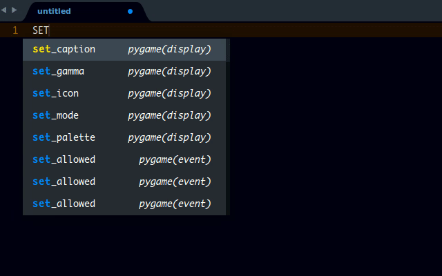

# Pygame Completions

A sublime text completion for pygame in Python

**Note**: It is advisable to disable all other python completions when using this package or disable this package when working on python files that doesnt require pygame. This gives you a cleaner interface but it is not necessary.

## Installation
> Important: You need to have `Package Control` installed first on your sublime text which can be found at [The Package Contol Website](http://packagecontrol.io)

### Using Package Control's Repository

Go to `Preferences` --> `Package Control` --> `Install package` --> then type into the textbox `Pygame Completions`

The package will be installed and ready for use.

### Using Git

Locate your Sublime Text `Packages` directory by using the menu item `Preferences -> Browse Packages...`.

While inside the `Packages` directory, clone the theme repository using the command below:

    git clone https://github.com/tushortz/Pygame-Completions

or just download the zipped folder, extract it and paste the extracted folder into your sublime text packages directory.

## Contributing

All contributions are welcome. fork Pygame Completions on [Github](https://github.com/tushortz/Pygame-Completions) and create a pull request. Any suggestions or bugs, please let me know.

## Licence

© 2016 Taiwo Kareem | taiwo.kareem36@gmail.com.

**Read license.txt**

## Acknowledgements

I'd first like to say a very big thank you to God my creator. Without him, this wouldn't be possible.
